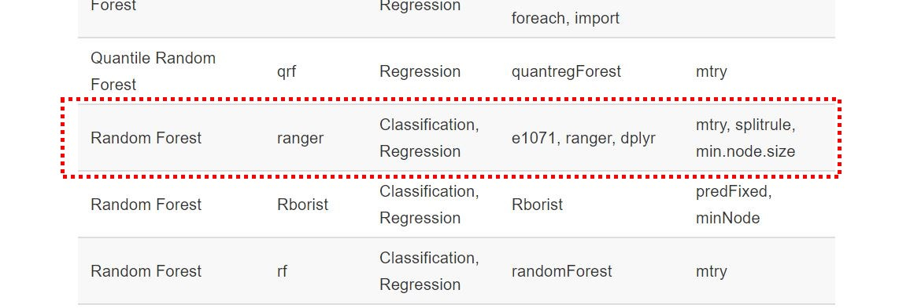

# Goal

We are going to show how to tune hyperparameters of a model, using cross-validation. As you have learned in previous labs, the `train` function in `caret` library incorporates model selection in its process, and often stores parameter tuning results in its output.

For the purpose of illustration, we will demonstrate the steps of model selection to tune a `Random Forest` model predicting `SkillLevel` in the DotAlicious data set.

## Brief Refresher

Model selection refers the task of tuning *hyperparameters*, i.e., parameters that need to be fixed before learning a model. `Cross-validation` is a popular approach to achieve that: it splits the training data into equal parts and use them for training and validation.

## Preparation: Load the data

First, load libraries.
```{r}
options(repos = c(CRAN = "http://cran.rstudio.com"))
install.packages("caret", dependencies = TRUE)
install.packages("e1071", dependencies = TRUE)
install.packages("ranger", dependencies = TRUE)
install.packages("dplyr", dependencies = TRUE)

library("e1071")
library("ranger")
library("dplyr")
library("caret")
```

Load and clean up data.
```{r}
# read the CSV file
DotaData <- read.csv("DoTalicious_cleaned1000players.csv", fileEncoding="UTF-8-BOM")

# convert TotalTime
DotaData$TotalTime <- as.numeric(DotaData$TotalTime)

# exclude the row with SillLevel = SkillLevelNull
DotaData <- DotaData[!(DotaData$SkillLevel == " SkillLevelNull"),]

# use factor in place of as.factor to remove " SkillLevelNull" from the list of factors
DotaData$SkillLevel <- factor(DotaData$SkillLevel)

# make the names of levels descriptive
levels(DotaData$SkillLevel) <- c("Novice", "Beginner", "Intermediate", "Advanced")

# exclude PlayerID
DotaData <- DotaData[-1]

DotaData = na.omit(DotaData)

summary(DotaData)
```

Next, set up training and test set.

```{r}
# setting the random seed
set.seed(1070)
indxTrain <- createDataPartition(y = DotaData$SkillLevel, p = 0.75,list = FALSE)
training <- DotaData[indxTrain,]
testing <- DotaData[-indxTrain,]
```

# Step 2: Find out what parameters are tunable

Unlike the Labs in Chapter 6, we are going to dig a little bit deeper into the setup of hyperparameter tuning for `Random Forest`.

First, we check which parameters are available for tuning with our Random Forest model.

* Go to the "Available Models" page of `caret` [here](https://topepo.github.io/caret/available-models.html)
* Search for "Random Forest"
* Note the hyperparameters available, i.e., `mtry`, `splitrule`, and `min.node.size`


```{r pressure, echo=FALSE, fig.cap="The Random Forest model used", out.width = '100%'}
library(knitr)

```


# Step 3: Set up a grid of parameter configurations

`caret` allows us to specify a set of parameter configurations to be tried, in the form of a parameter grid, for example,

```{r}
# set up grid search for parameter tuning
parameterGrid <- expand.grid(mtry = c(2, 4, 6, 10, 15),
                             splitrule = c("gini", "extratrees"),
                             min.node.size = c(1, 2, 3, 5, 7, 10))

```

Note that the above setup results in `5*2*6=60` different parameter configurations, which is equivalent to comparing 60 different Random Forest models to get the best one. This obviously takes a lot longer than, let's say, comparing only 10 different models, since training the models takes some time. As such, you may need to take into account such computational demand when setting up your grid to reduce the training time.

Alternatively, you may let `caret` decide automatically for you the set of parameter configurations to try, and just specify a maximum number of configurations, using the `tuneLength` parameter in the `train` function.

# Step 4: Set up cross validation

Cross validation set up is specified in the `trainControl` function.
```{r}
ctrl <- trainControl(method="repeatedcv", number = 10, repeats = 3)
```

Here, we set the method to `repeatedcv` (Repeated Cross-Validation), with the number of folds being 10, and number of repeats being 3. This means that we will run 3 separate Cross Validation tests, each comprising of 10 rotations of data, the result of which is the average of these 30 tests.

# Step 5: Train the model with cross validation and parameter grid

Putting the cross validation and parameter grid setup together in the `train` function below.
```{r}
set.seed(101)
rf_model <- train(SkillLevel ~ ., data = training, method = "ranger",
                  importance = "permutation",
                  trControl = ctrl, 
                  tuneGrid = parameterGrid)
```

```{r}
#let's look at the model
rf_model
```

If you want to let `caret` decide the parameters automatically, you can run the `train` function with `tuneLength` set to the number of configurations, and unset `tuneGrid`.

```{r}
set.seed(101)
rf_model_auto <- train(SkillLevel ~ ., data = training, method = "ranger",
                  importance = "permutation",
                  trControl = ctrl, 
                  tuneLength = 10)
```

# Step 6 (optional): Plot the accuracy of the models

```{r}
plot(rf_model)
```

The plot shows the accuracy obtained by the models tried, with

* "#Randomly Selected Predictors" being `mtry`, 
* "Minimal Node Size" being `min.node.size`, and
* *gini* and *extratrees* being values for `splitrule`


The one achieving the best acuracy, which in this case corresponds to `mtry=15, splitrule=gini, min.node.size=5` is stored in the slot `finalModel` of the output `train` object. 

# Step 7: Apply the model to the test set

```{r}
predicted <- predict(rf_model, newdata = testing)
confusionMatrix(predicted, testing$SkillLevel )
```

The performance here is slightly better than the model we obtained in Chapter 6 Lab 8, which was not tuned as rigorously. This, therefore, demonstrates the power of properly tuning a model: you'll get the best model possible.

# Conclusion
In this lab, we showed the process of setting cross validation and parameter tunning with modelsd developed under the `caret` package.